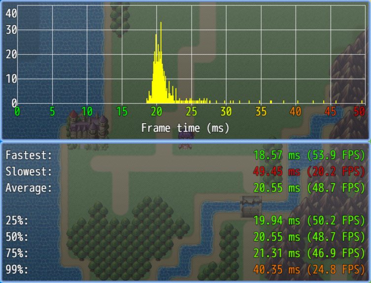
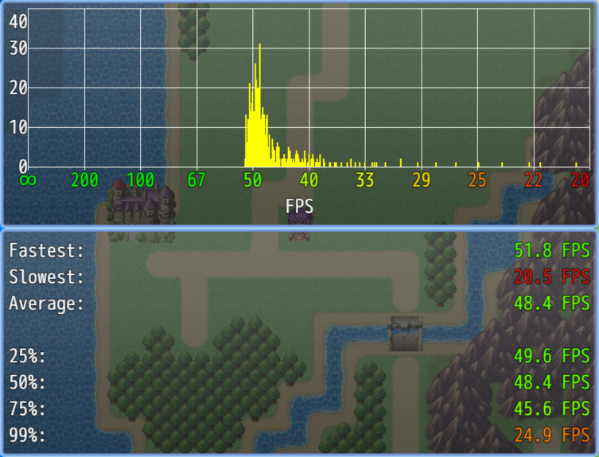

# N_Benchmark
Adds a benchmark option to the game.

| Frametime                              | FPS                              |
| -------------------------------------- | -------------------------------- |
|  |  |

**Notes**:
- Players can not interact with the game while the benchmark is running.
- After the benchmark, a window will be displayed with benchmarking statistics.
  - The x-axis represents frame time (how long it took to draw a frame) or FPS.
  - The y-axis describes how often a frame time (or FPS) was achieved.
  - Frame time/FPS numbers are colored for convenience:
    - Green: > 60 FPS
    - Yellow: 30 FPS
    - Red: < 20 FPS
- Players can return to the title screen at any time by pressing "OK" or "Cancel" or clicking anywhere in the game.

| Project     | Latest release      |
| ----------- | ------------------- |
| N_Benchmark | [Download][release] |

[All RPG Maker plugins by Nolonar][hub]

## Compatibility
Tested and confirmed working:
- RPG Maker MZ

## Terms of Use
According to [LICENSE](LICENSE).

  [hub]: https://github.com/Nolonar/RM_Plugins
  [release]: https://github.com/Nolonar/RM_Plugins-Benchmark/releases/latest/download/N_Benchmark.js
